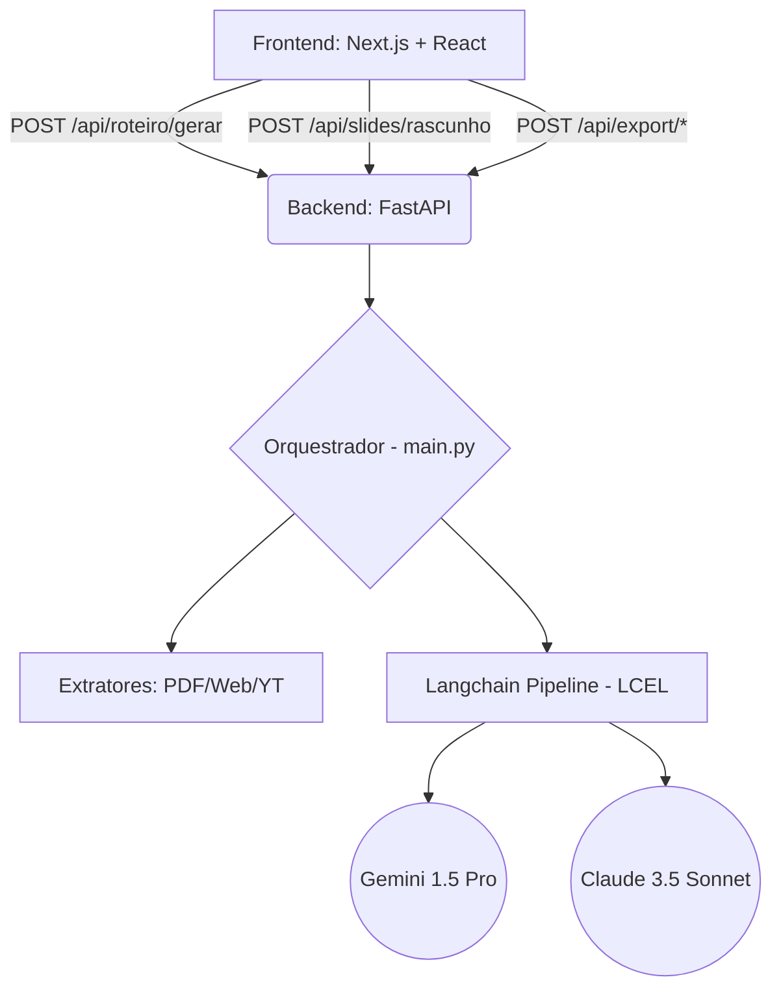

# Arquitetura do Syllabus

O **Syllabus** é uma plataforma que utiliza modelos avançados de Inteligência Artificial para gerar roteiros de ensino densos e construir apresentações visualmente ricas (Slides).

A plataforma é dividida em dois pólos:
- **Backend**: FastAPI e Langchain com processamento massivamente assíncrono.
- **Frontend**: Next.js (React) estilizado com TailwindCSS e animações em Framer Motion.

---

## 1. Visão Geral da Arquitetura

O sistema emprega um padrão de separação Frontend/Backend, comunicando-se exclusivamente via REST API e WebSockets (indiretos via assincronicidade interna).

---

## 2. Componentes do Backend (`src/preparo_de_aula/`)

O core de inteligência reside no backend.

### 2.1 API Endpoints (`api.py`)
Expõe a comunicação para o Frontend lidando com a gestão de arquivos temporários usando *UUIDs* de forma segura para múltiplas conexões concorrentes.
- `POST /api/roteiro/gerar`: Constrói a arquitetura estrutural da aula baseada nos parâmetros do usuário e pesquisa cruzada (DuckDuckGo + Gemini).
- `POST /api/slides/rascunho`: Pega um texto bruto ou um Markdown formatado e o reduz para formato *Reveal.js* (Claude 3.5).
- `POST /api/export/html`: Agrupa o pacote de Slides HTML.
- `POST /api/export/docx`: Entrega um arquivo `.docx` gerado nativamente via `htmldocx`.

### 2.2 Orquestração Assíncrona (`main.py` e `langchain_pipeline.py`)
Utilizamos `asyncio` e bibliotecas preparadas para concorrência (`litellm.acompletion` e chamadas LCEL async).
1. **Fase 0:** Extração multiformato (PDF, URL, YouTube).
2. **Fase 1:** Geração de Mapa Estrutural Rápido com Gemini 1.5.
3. **Fase 2:** Agentes Pesquisadores Assíncronos expandem tópicos em paralelo na web.
4. **Fase 3:** Map-Reduce das explicações teóricas densas através do Claude 3.5.

---

## 3. Componentes do Frontend (`frontend/src/app/`)

Foi desenhado um monólito visual limpo e divido em componentes reusáveis seguindo boas práticas do React:
- `page.tsx`: Gerenciador de Estados global (inputs do usuário, loadings, alternador de tab).
- `Header.tsx`: Componente puramente visual (Branding).
- `PreviewPanel.tsx`: Componente visualizador da plataforma, exibindo em tempo real o Render de Markdown com opções de exportação direta e *callbacks*.

---

## 4. Integração de IA e Modelos
Para lidar com restrições e viabilizar inteligência híbrida:
- **Google Gemini (1.5 Pro)** atua via Langchain LCEL. Especializado no processamento bruto de dados e mapeamento estrutural por ser extremante ágil na leitura de contextos densos.
- **Anthropic Claude (3.5 Sonnet)** atua via LiteLLM. Focado primariamente na oratória pedagógica e montagem do roteiro final descritivo por possuir uma linguagem humana superior e capacidades avançadas de síntese (Markdown).
